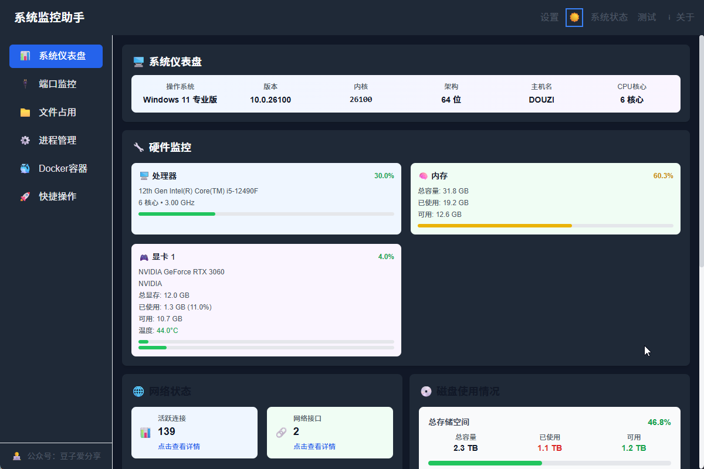

# 系统监控助手

一个现代化的Windows系统监控和管理工具，提供直观的界面和丰富的系统管理功能。



## 功能特性

### 系统仪表盘
- 实时监控CPU、内存、GPU使用情况
- 显示网络接口和连接状态
- 监控磁盘使用情况

### 端口监控
- 显示所有监听端口和活动连接
- 智能识别常见应用程序和服务
- 一键复制端口信息或终止进程

### 文件占用监控
- 检测被锁定的文件
- 识别占用文件的进程
- 提供解锁文件的解决方案

### 进程管理
- 显示所有运行中的进程
- 监控进程资源使用情况
- 终止进程或设置优先级

### Docker容器管理
- 监控Docker容器状态
- 查看容器详细信息和日志
- 启动、停止、重启容器

### 系统工具集
- 快速访问系统管理工具
- 执行常用命令行操作
- 打开系统设置和控制面板

## 安装使用

### 普通用户

1. 从[Releases页面](https://github.com/weixin008/SysToolkit/releases)下载最新版本
2. 运行安装程序，按照向导完成安装
3. 从开始菜单或桌面快捷方式启动应用

### 开发者

如果您想参与开发：

1. 克隆项目并安装依赖
```bash
git clone https://github.com/weixin008/SysToolkit.git
npm install
```

2. 开发模式运行
```bash
npm run tauri dev
```

3. 构建应用
```bash
npm run tauri build
```

## 使用说明

### 系统仪表盘
系统仪表盘显示系统的实时状态，包括CPU、内存、GPU、磁盘和网络信息。数据会自动刷新，确保信息的实时性。

### 端口监控
端口监控页面显示所有正在监听的端口和活动连接。支持卡片视图和列表视图两种显示模式，可以按端口号、进程名或协议进行搜索和过滤。

### 文件占用监控
输入文件路径可以检测该文件是否被占用。如果文件被占用，会显示占用进程的详细信息，并提供解锁文件的建议。

### 进程管理
进程管理页面显示所有运行中的进程。支持卡片视图和列表视图两种显示模式，可以按进程名、PID或资源使用情况进行搜索和过滤。

### Docker容器管理
Docker容器管理页面显示所有Docker容器。容器状态使用不同颜色标识：绿色（运行中）、红色（已停止）、黄色（异常）。

### 系统工具
系统工具分为多个类别，包括系统管理、系统设置、存储、网络安全、开发工具、命令行工具和网络诊断。点击工具按钮可以执行对应的操作。

## 技术支持

如有问题或建议，请通过以下方式联系我们：

- [GitHub Issues](https://github.com/weixin008/SysToolkit/issues)


## 📄 许可证与版权

本项目采用**双协议授权模式**，为不同使用场景提供灵活的许可证选择。

### 🆓 开源协议 - GNU GPL v3

**适用场景：**
- ✅ 个人学习和研究
- ✅ 开源项目集成
- ✅ 非商业用途
- ✅ 学术研究

**使用条件：**
- 必须保持开源并使用相同协议
- 必须保留版权声明和许可证信息
- 衍生作品必须同样开源
- 不得移除或修改作者信息

📋 详情请查看：[LICENSE](LICENSE) 文件

### 💼 商业协议 - 专有许可证

**适用场景：**
- 🏢 企业商业产品开发
- 🔒 闭源软件集成
- 🏭 企业内部使用
- 📦 不希望开源的项目

**优势：**
- 无需开源您的代码
- 获得商业技术支持
- 定制化开发服务
- 法律风险保障

📞 **获取商业许可证：**
- 📧 商业咨询：[qinshou457@gmail.com](mailto:qinshou457@gmail.com)
- 💬 微信联系：扫描下方二维码

### ⚖️ 许可证选择指南

| 使用场景 | 推荐协议 | 费用 | 开源要求 | 技术支持 |
|---------|---------|------|---------|---------|
| 个人学习 | GPL v3 | 免费 | 是 | 社区支持 |
| 开源项目 | GPL v3 | 免费 | 是 | 社区支持 |
| 商业产品 | 商业协议 | 付费 | 否 | 专业支持 |
| 企业内部 | 商业协议 | 付费 | 否 | 专业支持 |

### 🚫 反盗版声明

**⚠️ 严重警告：**

本软件受版权法和国际版权条约保护。**严禁**以下行为：

- ❌ **冒充原创**：移除版权信息或声称为自己的原创作品
- ❌ **商标侵权**：未经授权使用项目名称、图标、标识
- ❌ **违法分发**：在未遵守许可证条款的情况下分发软件
- ❌ **恶意竞争**：基于本软件开发竞争产品而不遵守开源协议

**🔍 监控机制：**
- 我们使用技术手段监控网络上的盗版行为
- 发现违规将立即采取法律行动
- 已委托专业律师事务所处理知识产权事务

**📞 举报渠道：**
- 举报邮箱：[qinshou457@gmail.com](mailto:qinshou457@gmail.com)
- 举报奖励：提供有效线索者将获得现金奖励

### 📋 详细协议文档

- 📖 [双协议说明](LICENSE-DUAL.md) - 完整的双协议使用指南
- 📄 [商业协议模板](LICENSE-COMMERCIAL-TEMPLATE.md) - 商业许可证详细条款
- ⚖️ [GPL v3 协议](LICENSE) - 开源协议完整文本

### 💡 常见问题

**Q: 我可以免费用于商业项目吗？**
A: 如果您的项目也开源并使用 GPL v3，可以免费使用。闭源商业项目需要购买商业许可证。

**Q: 商业许可证包含什么？**
A: 包含闭源使用权、技术支持、定制开发、法律保障等服务。

**Q: 如何确保不侵犯版权？**
A: 严格遵守许可证条款，保留所有版权声明，不声称为自己的作品。

**Q: 发现盗版怎么办？**
A: 请立即联系我们的法务团队，我们将采取法律行动维护权益。

## 关注与支持

### 微信公众号

欢迎关注我的微信公众号，获取更多技术分享和软件更新：


### 赞赏支持

如果您觉得这个工具对您有帮助，可以扫描下方二维码支持开发者：


感谢您的支持！

### 开源贡献

- GitHub: [weixin008](https://github.com/weixin008)
- 欢迎提交Issue和Pull Request
